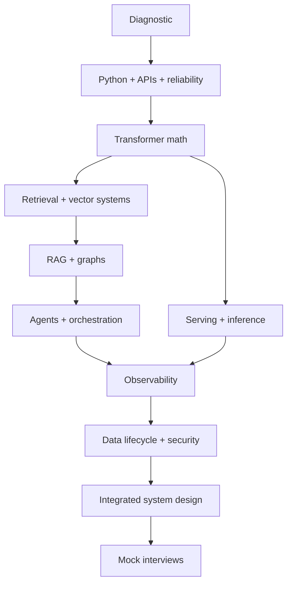

# AI Engineering Interview Atlas

> 192 topics, 111 technology profiles, 2253 generated practice questions, 50 core interview questions, and 26 system-design challenges.

A research-grounded practice repository for AI engineering, LLM systems, RAG, agents, deployment, data, observability, theory, and backend engineering.

## Use the atlas

- Open `index.html` through GitHub Pages for the guided resume -> read -> exam -> advance course, ordered roadmap, technology field guide, mathematical tutorials, search, flashcards, and design drills.
- Read `output/pdf/ai_engineering_interview_handbook.pdf` for the complete printable handbook.
- Use `data/technologies.json`, `data/technology_questions.json`, `data/tutorials.json`, `data/formulas.json`, `data/visuals.json`, `data/roadmap.json`, and the sharded curriculum-question files for custom study tools.

## Technology field guide

The dedicated catalog contains 111 current libraries, protocols, databases, runtimes, and platforms across 9 layers. Every profile includes its role, execution flow, languages, deployment shape, quick start, selection and rejection criteria, alternatives, failure mode, official documentation, logo or labeled fallback, and medium/hard/very-hard interview prompts.

### Agent and application frameworks

LangChain · LangGraph · Deep Agents · LlamaIndex · Haystack · Semantic Kernel · AutoGen · CrewAI · PydanticAI · DSPy · OpenAI Agents SDK · Google Agent Development Kit · Mastra · Zep · Mem0

### Model, embedding, and optimization libraries

PyTorch · JAX · Hugging Face Transformers · Sentence Transformers · Hugging Face PEFT · bitsandbytes · ONNX Runtime · OpenVINO · FlagEmbedding · Instructor · Cohere Rerank

### Model serving, gateways, and inference

vLLM · SGLang · Hugging Face Text Generation Inference · TensorRT-LLM · NVIDIA Triton Inference Server · llama.cpp · Ollama · KServe · Ray Serve · BentoML · LocalAI · Modal · Baseten · Hugging Face Inference Endpoints · Hugging Face Text Embeddings Inference · LiteLLM · Portkey AI Gateway · Kong AI Gateway · Envoy AI Gateway · Amazon SageMaker AI Endpoints · Vertex AI Endpoints · Azure Machine Learning Managed Online Endpoints

### Retrieval, vector, and graph data

pgvector · Pinecone · Qdrant · Weaviate · Milvus and Zilliz · Chroma · LanceDB · FAISS · Elasticsearch · OpenSearch · Vespa · Redis Search and Vector Sets · Neo4j · Memgraph · FalkorDB · Amazon Neptune · Kuzu

### Observability and evaluation

LangSmith · Langfuse · Arize Phoenix · Helicone · OpenTelemetry · MLflow · Weights & Biases Weave · Braintrust · Ragas · DeepEval · TruLens · Evidently · Promptfoo

### Safety, validation, and policy guardrails

NVIDIA NeMo Guardrails · Guardrails AI · Llama Guard · Protect AI LLM Guard · Microsoft Presidio · Open Policy Agent · Cedar · Lakera Guard

### MCP and tool connectivity

Model Context Protocol · Official MCP SDKs · FastMCP · MCP Inspector · Docker MCP Toolkit and Gateway · Smithery · Composio · Arcade

### Sandbox and code execution

E2B · Daytona · Modal Sandboxes · Docker · gVisor · Firecracker · Kata Containers · Kubernetes Jobs

### Data, workflow, and ML lifecycle

Temporal · Apache Airflow · Prefect · Dagster · DVC · lakeFS · Feast · Kubeflow Pipelines · ZenML

## Curriculum map

### Retrieval and Search Theory

BM25 · TF-IDF · Dense retrieval · Sparse neural retrieval · Late interaction · Cross-encoder reranking · Hybrid retrieval · Reciprocal rank fusion · ANN recall · Retrieval metrics · Embedding geometry · Query expansion

### Vector Databases and Search Engines

pgvector · Pinecone · Qdrant · Weaviate · Milvus and Zilliz · Elasticsearch vector search · OpenSearch vector search · Redis vector search · Chroma · LanceDB · Vespa · HNSW · IVF and PQ · Metadata filtering

### RAG Architecture and Evaluation

Document ingestion · Chunking · Parent-child retrieval · Contextual compression · Query routing · Multi-query retrieval · HyDE · Reranking pipeline · Context packing · Grounded generation · RAG evaluation · Faithfulness · Answer relevance · Synthetic test generation · Online RAG monitoring

### Knowledge Graphs and GraphRAG

Property graphs · RDF and ontologies · Cypher · Knowledge graph construction · Entity resolution · GraphRAG local search · GraphRAG global search · KAG · Graph quality evaluation · Temporal knowledge graphs

### Agents, MCP, and Control

Agent loop · ReAct · Planning · Reflection · Tool calling · Model Context Protocol · Agent memory · Human in the loop · State machines · Idempotent tools · Agent handoffs · Autonomy levels · Context engineering · Sandbox runs

### Orchestration Frameworks

LangGraph · LlamaIndex workflows · Haystack pipelines · PydanticAI · Semantic Kernel · AutoGen · CrewAI · DSPy · Temporal · Airflow, Dagster, and Prefect

### Observability and Monitoring

OpenTelemetry · Distributed tracing · LLM tracing · Metrics and SLOs · Structured logging · LangSmith · Langfuse · Arize Phoenix · MLflow tracing · W&B Weave · Prompt and model drift · Cost observability · Evaluation in production

### Serving, Deployment, and LLMOps

vLLM · SGLang · Text Generation Inference · TensorRT-LLM · NVIDIA Triton · llama.cpp · KServe · Ray Serve · BentoML · Kubernetes and GPUs · LLM gateways · Canary and shadow releases · Model registry · Autoscaling for LLMs

### Data and ML Lifecycle

DVC · lakeFS · Delta Lake and Iceberg · Feature stores · Point-in-time correctness · Experiment tracking · Data contracts · Data quality testing · Data lineage · Reproducible environments

### Transformer Theory and Training

Tokenization · Embedding layer · Self-attention math · Multi-head attention · Positional encoding · RoPE · Feed-forward networks · Layer normalization and RMSNorm · Residual connections · Mixture of Experts · Causal language modeling · Cross-entropy and perplexity · SFT · RLHF and PPO · DPO · LoRA · QLoRA · Knowledge distillation

### Inference Optimization

KV caching · PagedAttention · Continuous batching · Prefix caching · FlashAttention · GQA and MQA · Speculative decoding · Quantization · Tensor parallelism · Pipeline parallelism · Data parallel inference · Expert parallelism · Dynamic batching · Streaming generation

### Backend, APIs, and Microservices

FastAPI · Starlette · Litestar · Flask · Django and DRF · REST API design · gRPC · WebSockets and SSE · API idempotency · Rate limiting · Circuit breakers · Microservice boundaries · Event-driven architecture · Object-oriented design

### Python Engineering

Python threading and the GIL · Multiprocessing · Asyncio · Concurrent futures · Decorators · Context managers · Generators · Descriptors and properties · Dataclasses and Pydantic · Type hints and protocols · Exceptions · Memory management · Testing and mocking · Packaging and environments

### Security, Safety, and Governance

Prompt injection · Tool authorization · Secrets management · Sandboxing · Data privacy · Output validation · Model supply chain · AI risk management · Red teaming · Auditability

### Distributed Systems and Reliability

CAP and consistency · Consensus · Queues and backpressure · Retries and timeouts · Caching · Load balancing · Fault isolation · Exactly-once effects · Multi-region design · Capacity planning

## Ordered study roadmap



The browser resumes the last unfinished lesson, records five reading checkpoints, unlocks a five-question topic exam, and advances after an 80% passing score. Roadmap phases with lessons complete automatically when every chapter in the phase is passed.

## Visual and mathematical coverage

The handbook and site include 15 core instructional diagrams and plots, 111 technology-specific flow diagrams, 9 comparison maps, and 33 formula modules with assumptions, variable definitions, derivations, and worked interpretations. Browser equations use MathJax; the source handbook uses native LaTeX with `amsmath`, `amssymb`, `mathtools`, and TikZ.

## Source policy

Explanations are original synthesis grounded in primary papers, official documentation, specifications, and standards. The question bank does not copy proprietary interview banks. Technology logos are identification marks loaded from the Simple Icons CDN when available, with clearly labeled local fallbacks. See [SOURCES.md](SOURCES.md).

## Rebuild

```bash
python3 tools/build_content.py
latexmk -pdf -interaction=nonstopmode -halt-on-error handbook/ai_engineering_interview_handbook.tex
```

The Pages workflow performs the LaTeX compilation before publishing, so a broken derivation or command blocks deployment.

## License

Educational content and code are released under the MIT License. Third-party names and marks belong to their respective owners.
