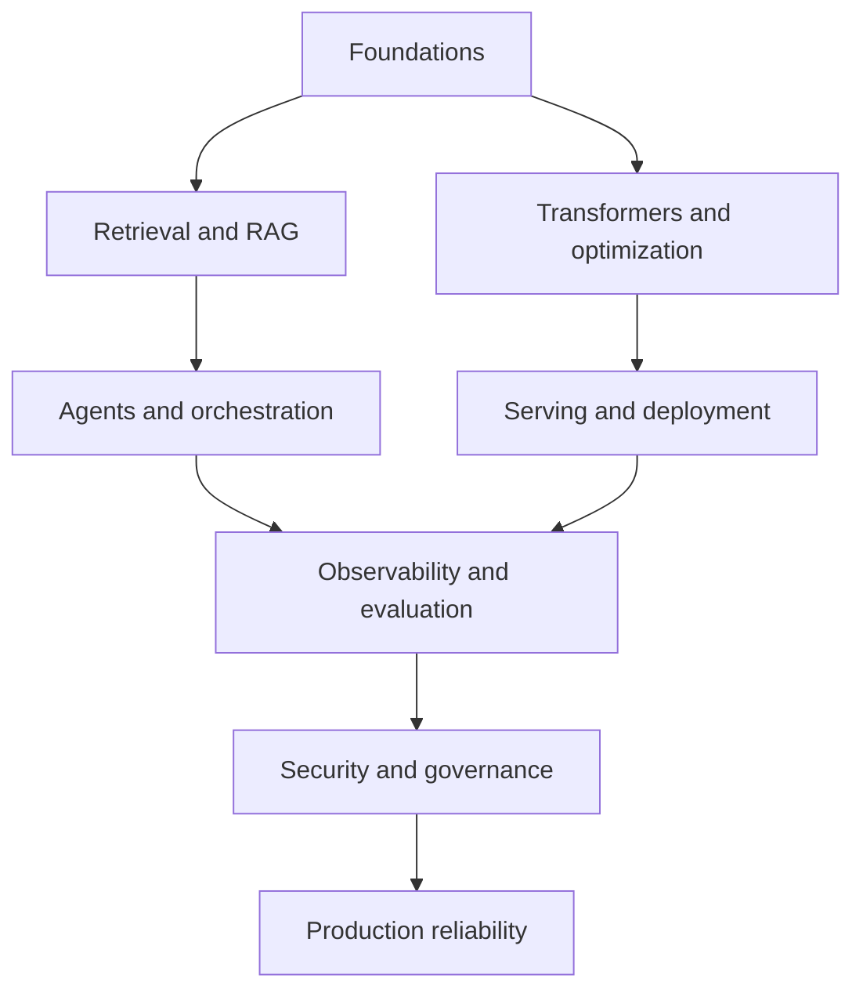

# AI Engineering Interview Atlas

> 192 topics, 1920 generated practice questions, 50 core interview questions, and 12 system-design challenges.

A research-grounded practice repository for AI engineering, LLM systems, RAG, agents, deployment, data, observability, theory, and backend engineering.

## Use the atlas

- Open `index.html` through GitHub Pages for search, filters, flashcards, and design drills.
- Read `output/pdf/ai_engineering_interview_handbook.pdf` for the complete printable handbook.
- Use `data/questions.json` and `data/topics.json` for custom study tools.

## Curriculum map

### Retrieval and Search Theory

BM25 · TF-IDF · Dense retrieval · Sparse neural retrieval · Late interaction · Cross-encoder reranking · Hybrid retrieval · Reciprocal rank fusion · ANN recall · Retrieval metrics · Embedding geometry · Query expansion

### Vector Databases and Search Engines

pgvector · Pinecone · Qdrant · Weaviate · Milvus and Zilliz · Elasticsearch vector search · OpenSearch vector search · Redis vector search · Chroma · LanceDB · Vespa · HNSW · IVF and PQ · Metadata filtering

### RAG Architecture and Evaluation

Document ingestion · Chunking · Parent-child retrieval · Contextual compression · Query routing · Multi-query retrieval · HyDE · Reranking pipeline · Context packing · Grounded generation · RAG evaluation · Faithfulness · Answer relevance · Synthetic test generation · Online RAG monitoring

### Knowledge Graphs and GraphRAG

Property graphs · RDF and ontologies · Cypher · Knowledge graph construction · Entity resolution · GraphRAG local search · GraphRAG global search · KAG · Graph quality evaluation · Temporal knowledge graphs

### Agents, MCP, and Control

Agent loop · ReAct · Planning · Reflection · Tool calling · Model Context Protocol · Agent memory · Human in the loop · State machines · Idempotent tools · Agent handoffs · Autonomy levels · Context engineering · Sandbox runs

### Orchestration Frameworks

LangGraph · LlamaIndex workflows · Haystack pipelines · PydanticAI · Semantic Kernel · AutoGen · CrewAI · DSPy · Temporal · Airflow, Dagster, and Prefect

### Observability and Monitoring

OpenTelemetry · Distributed tracing · LLM tracing · Metrics and SLOs · Structured logging · LangSmith · Langfuse · Arize Phoenix · MLflow tracing · W&B Weave · Prompt and model drift · Cost observability · Evaluation in production

### Serving, Deployment, and LLMOps

vLLM · SGLang · Text Generation Inference · TensorRT-LLM · NVIDIA Triton · llama.cpp · KServe · Ray Serve · BentoML · Kubernetes and GPUs · LLM gateways · Canary and shadow releases · Model registry · Autoscaling for LLMs

### Data and ML Lifecycle

DVC · lakeFS · Delta Lake and Iceberg · Feature stores · Point-in-time correctness · Experiment tracking · Data contracts · Data quality testing · Data lineage · Reproducible environments

### Transformer Theory and Training

Tokenization · Embedding layer · Self-attention math · Multi-head attention · Positional encoding · RoPE · Feed-forward networks · Layer normalization and RMSNorm · Residual connections · Mixture of Experts · Causal language modeling · Cross-entropy and perplexity · SFT · RLHF and PPO · DPO · LoRA · QLoRA · Knowledge distillation

### Inference Optimization

KV caching · PagedAttention · Continuous batching · Prefix caching · FlashAttention · GQA and MQA · Speculative decoding · Quantization · Tensor parallelism · Pipeline parallelism · Data parallel inference · Expert parallelism · Dynamic batching · Streaming generation

### Backend, APIs, and Microservices

FastAPI · Starlette · Litestar · Flask · Django and DRF · REST API design · gRPC · WebSockets and SSE · API idempotency · Rate limiting · Circuit breakers · Microservice boundaries · Event-driven architecture · Object-oriented design

### Python Engineering

Python threading and the GIL · Multiprocessing · Asyncio · Concurrent futures · Decorators · Context managers · Generators · Descriptors and properties · Dataclasses and Pydantic · Type hints and protocols · Exceptions · Memory management · Testing and mocking · Packaging and environments

### Security, Safety, and Governance

Prompt injection · Tool authorization · Secrets management · Sandboxing · Data privacy · Output validation · Model supply chain · AI risk management · Red teaming · Auditability

### Distributed Systems and Reliability

CAP and consistency · Consensus · Queues and backpressure · Retries and timeouts · Caching · Load balancing · Fault isolation · Exactly-once effects · Multi-region design · Capacity planning

## Architecture map



## Source policy

Explanations are original synthesis grounded in primary papers, official documentation, specifications, and standards. The question bank does not copy proprietary interview banks. See [SOURCES.md](SOURCES.md).

## Rebuild

```bash
python3 tools/build_content.py
latexmk -pdf -interaction=nonstopmode -halt-on-error -outdir=handbook handbook/ai_engineering_interview_handbook.tex
```

## License

Educational content and code are released under the MIT License. Third-party names belong to their respective owners.
